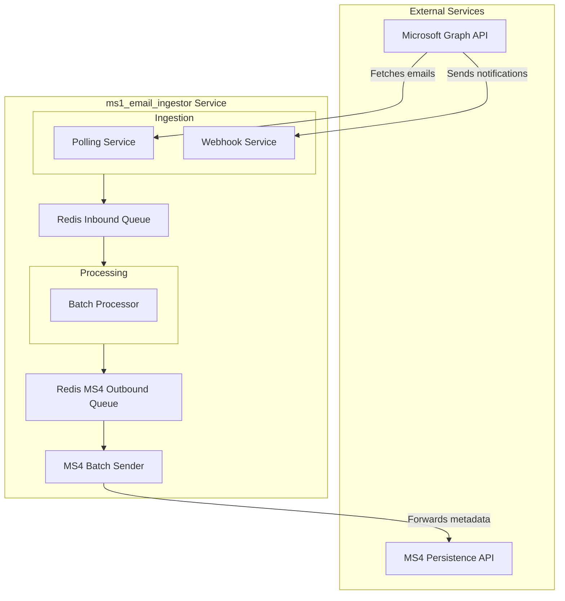
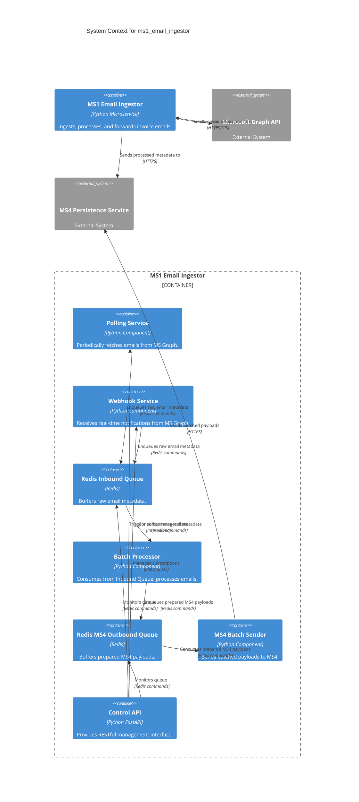
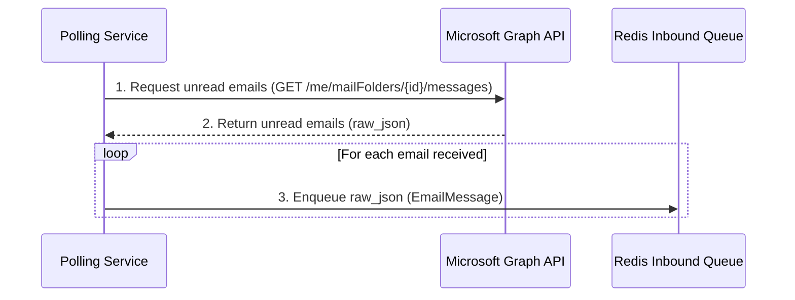
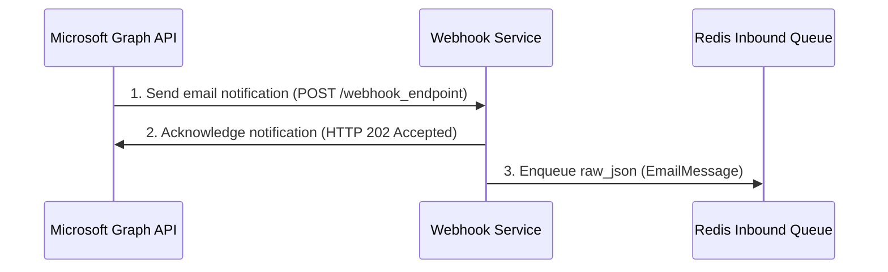
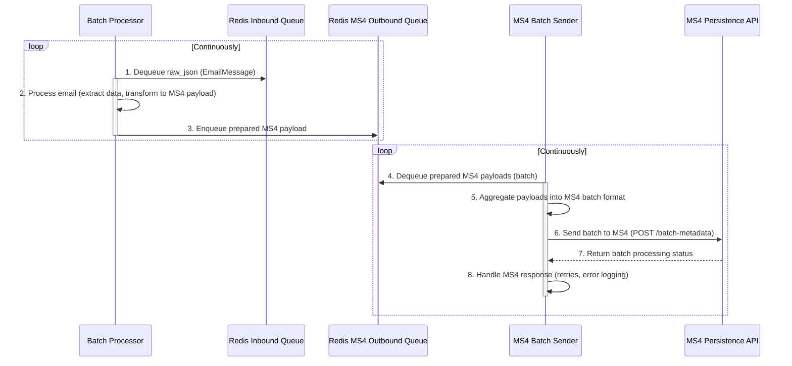

# ms1_email_ingestor Architecture Document

## 1. Introduction

This document outlines the overall project architecture for the `ms1_email_ingestor` enhancement project, including backend systems, shared services, and non-UI specific concerns. Its primary goal is to serve as the guiding architectural blueprint for AI-driven development, ensuring consistency and adherence to chosen patterns and technologies.

### 1.1. Starter Template or Existing Project

This is a brownfield project. The architecture described herein is an evolution of the existing `ms1_email_ingestor` codebase. All work will be performed by modifying the current system, guided by the requirements in `docs/prd.md`. No new starter template will be used.

### 1.2. Change Log

| Date | Version | Description | Author |
| :--- | :--- | :--- | :--- |
| 2025-10-30 | 0.1 | Initial architecture draft based on PRD | Winston |

---

## 2. High Level Architecture

### 2.1. Technical Summary

The `ms1_email_ingestor` is a Python-based, queue-centric microservice designed for high-volume email ingestion and processing. It leverages Redis for resilient queuing, a `ThreadPool`-based batch processor for parallel execution, and FastAPI for its control and webhook APIs. The proposed architecture enhances this existing model by standardizing the HTTP client to `httpx`, introducing robust rate-limiting and retry mechanisms, and refactoring the core processing pipeline to support batch forwarding to downstream services via a dedicated outbound queue. This directly supports the PRD goals of performance, resilience, and modernization.

### 2.2. High Level Overview

The architecture is a **self-contained microservice** operating within a **monorepo** structure. The fundamental data flow is enhanced: email notifications are ingested via polling or webhooks and are immediately placed onto a Redis-backed inbound queue. A separate `batch_processor` service consumes from this inbound queue, processes the emails, and then places the prepared data onto a new **MS4 Outbound Queue**. A dedicated **MS4 Batch Sender** then consumes from this outbound queue and forwards aggregated metadata to the MS4 Persistence service. This evolution further hardens the system against external dependencies and optimizes for targeted, high-impact improvements like batching and resilience.

### 2.3. High Level Project Diagram



### 2.4. Architectural and Design Patterns

*   **Queue-Centric Workflow (Inbound):** We will retain the existing pattern of using a central Redis queue to decouple the ingestion and processing stages.
    *   *Rationale:* This is the cornerstone of the system's resilience and ability to buffer high-volume traffic, preventing data loss during processing spikes or downstream failures.
*   **Queue-Centric Workflow (Outbound to MS4):** A new Redis queue will be introduced to buffer processed data before it is sent to the MS4 Persistence service.
    *   *Rationale:* This further decouples our service from MS4, enhancing resilience against MS4 downtime or performance issues, and allows for optimized batching and retry logic specific to MS4.
*   **Batch Processing:** The `batch_processor` will prepare multiple processed items, and a new `MS4 Batch Sender` will collect these from the outbound queue before sending them to the MS4 service in a single outbound request.
    *   *Rationale:* This is the primary strategy to achieve the 10,000 invoice/session throughput goal by dramatically reducing network I/O overhead and optimizing for MS4's API.
*   **Circuit Breaker & Retry:** All outbound API calls (including from the new MS4 Batch Sender) will be wrapped with policies to handle transient faults.
    *   *Rationale:* As defined in Epic 2, this is critical for improving service resilience when interacting with external dependencies like the Microsoft Graph and MS4 APIs.
*   **Repository Pattern:** Data access will continue to be abstracted via dedicated manager modules (e.g., `redis_manager.py`).
    *   *Rationale:* This decouples business logic from the underlying data store implementation, simplifying testing and future maintenance.

---

## 3. Tech Stack

### 3.1. Cloud Infrastructure

*   **Provider:** AWS
*   **Key Services:**
    *   **Current Local:** Redis (for queuing, caching, session management)
    *   **Future AWS Equivalent:** AWS ElastiCache for Redis (for managed, scalable Redis service)
*   **Deployment Regions:** N/A for local development. For future AWS deployment, standard regions (e.g., `us-east-1`, `eu-west-1`) would be considered based on latency and compliance needs.

### 3.2. Technology Stack Table

| Category | Technology | Version | Purpose | Rationale |
| :--- | :--- | :--- | :--- | :--- |
| **Language** | Python | 3.x (Latest stable) | Primary development language | Existing codebase, strong ecosystem for data processing, team familiarity. |
| **Web Framework** | FastAPI | (Latest stable) | API endpoints for webhooks and control | Existing codebase, high performance, async-native, robust API development. |
| **HTTP Client** | `httpx` | (Latest stable) | All outbound HTTP requests | Standardized client (as per PRD NFR2), async support, connection pooling (as per PRD NFR3). |
| **Queue/Cache** | Redis | (Latest stable) | Inbound/Outbound queues, session management, rate limiting | Existing codebase, high performance, versatile data structures, critical for resilience and throughput. |
| **Auth Library** | `MSAL` | (Latest stable) | Microsoft Graph API authentication | Existing codebase, robust Microsoft identity integration. |
| **Deployment** | Direct Python Execution | N/A | Application execution | Existing deployment method, with codebase structured for future containerization (e.g., Docker) and deployment to AWS services (e.g., EC2, ECS, Lambda). |

---

## 4. Data Models

### 4.1. EmailMessage

**Purpose:** Represents an email ingested from Microsoft Graph, containing the raw metadata and essential derived attributes. This is the primary entity processed throughout the system.

**Key Attributes:**
- `id`: `string` - Unique identifier from Microsoft Graph.
- `sender_address`: `string` - Email address of the sender.
- `subject`: `string` - Subject line of the email.
- `received_datetime`: `datetime` - Timestamp when the email was received.
- `raw_json`: `JSON object` - The raw, complete metadata of the incoming email from Microsoft Graph.

**Relationships:**
- An `EmailMessage` is processed by the `Batch Processor`.
- Data for the `MS4 Persistence API` is extracted and transformed from the `raw_json` attribute.

### 4.2. SessionState

**Purpose:** Manages the operational state and metadata of a single email ingestion session.

**Key Attributes:**
- `session_id`: `string` - Unique identifier for the ingestion session.
- `status`: `string` - Current status of the session (e.g., "running", "paused", "completed", "error").
- `start_time`: `datetime` - Timestamp when the session was initiated.
- `end_time`: `datetime` - Timestamp when the session concluded.
- `emails_processed_count`: `integer` - Total number of emails successfully processed within the session.
- `emails_failed_count`: `integer` - Total number of emails that encountered processing failures within the session.

**Relationships:**
- Managed by the `core/session_manager.py` component.
- Persisted in Redis.

### 4.3. WebhookSubscription

**Purpose:** Stores the necessary details for managing the active Microsoft Graph webhook subscription, enabling real-time email notifications.

**Key Attributes:**
- `subscription_id`: `string` - Unique identifier provided by Microsoft Graph for the subscription.
- `resource`: `string` - The Microsoft Graph API resource being monitored (e.g., `/me/mailFolders('Inbox')/messages`).
- `expiration_datetime`: `datetime` - The timestamp when the subscription is scheduled to expire.
- `client_state`: `string` - A secret value provided by our application to Microsoft Graph for subscription validation.

**Relationships:**
- Managed by the `core/webhook_service.py` component.
- Persisted in Redis.

---

## 5. Components

### 5.1. Component List

### 5.1.1. Polling Service

**Responsibility:** Periodically fetches unread emails from the Microsoft Graph API, applies initial filtering, and enqueues the raw email metadata into the Redis Inbound Queue.

**Key Interfaces:**
- Outbound: Microsoft Graph API (HTTPS)
- Outbound: Redis Inbound Queue (Redis commands via `redis_manager`)

**Dependencies:** `httpx`, `MSAL`, `redis_manager`, `utils/config`.

**Technology Stack:** Python, `httpx`, `MSAL`.

### 5.1.2. Webhook Service

**Responsibility:** Receives real-time email notifications from Microsoft Graph via a webhook endpoint, validates them, and enqueues the raw email metadata into the Redis Inbound Queue. It also manages the lifecycle of Microsoft Graph webhook subscriptions.

**Key Interfaces:**
- Inbound: Microsoft Graph Webhook (HTTPS)
- Outbound: Redis Inbound Queue (Redis commands via `redis_manager`)
- Outbound: Microsoft Graph API (for subscription management, HTTPS)

**Dependencies:** FastAPI, `httpx`, `MSAL`, `redis_manager`, `utils/config`.

**Technology Stack:** Python, FastAPI, `httpx`, `MSAL`.

### 5.1.3. Redis Inbound Queue

**Responsibility:** Acts as a high-performance, resilient buffer for raw email metadata received from the Polling and Webhook Services. It decouples the ingestion process from the email processing logic.

**Key Interfaces:**
- Inbound: `redis_manager` (for enqueuing by Polling/Webhook Services)
- Outbound: `redis_manager` (for dequeuing by Batch Processor)

**Dependencies:** Redis server.

**Technology Stack:** Redis.

### 5.1.4. Batch Processor

**Responsibility:** Consumes raw email metadata from the Redis Inbound Queue, processes each email (e.g., extracts relevant data, applies business logic, transforms data into MS4-compatible format), and places the prepared MS4 payload onto the Redis MS4 Outbound Queue.

**Key Interfaces:**
- Inbound: Redis Inbound Queue (Redis commands via `redis_manager`)
- Outbound: Redis MS4 Outbound Queue (Redis commands via `redis_manager`)

**Dependencies:** `redis_manager`, `core/unified_email_processor` (for email-specific logic), `utils/config`.

**Technology Stack:** Python.

### 5.1.5. Redis MS4 Outbound Queue

**Responsibility:** Buffers prepared MS4 payloads, decoupling the `Batch Processor` from the `MS4 Batch Sender`. This provides additional resilience against MS4 unavailability and allows for optimized batching to MS4.

**Key Interfaces:**
- Inbound: `redis_manager` (for enqueuing by Batch Processor)
- Outbound: `redis_manager` (for dequeuing by MS4 Batch Sender)

**Dependencies:** Redis server.

**Technology Stack:** Redis.

### 5.1.6. MS4 Batch Sender

**Responsibility:** Consumes prepared MS4 payloads from the Redis MS4 Outbound Queue, aggregates them into optimal batches, and sends these batches to the MS4 Persistence API. It incorporates retry logic, rate limiting, and error handling specific to MS4 communication.

**Key Interfaces:**
- Inbound: Redis MS4 Outbound Queue (Redis commands via `redis_manager`)
- Outbound: MS4 Persistence API (HTTPS)

**Dependencies:** `httpx`, `redis_manager`, `utils/config`.

**Technology Stack:** Python, `httpx`.

### 5.1.7. Control API

**Responsibility:** Provides a RESTful interface for external systems or administrators to manage the `ms1_email_ingestor` service, including starting/stopping sessions, triggering manual polls, and retrieving service metrics.

**Key Interfaces:**
- Inbound: REST API (HTTPS)

**Dependencies:** FastAPI, `core/session_manager`, `core/queue_manager`, `utils/config`.

**Technology Stack:** Python, FastAPI.

### 5.2. Component Diagrams



---

## 6. External APIs

### 6.1. Microsoft Graph API

*   **Purpose:** Provides access to user mailboxes for email ingestion (polling) and real-time notifications (webhooks).
*   **Documentation:** `https://learn.microsoft.com/en-us/graph/api/overview?view=graph-rest-1.0`
*   **Base URL(s):** `https://graph.microsoft.com/v1.0`
*   **Authentication:** OAuth 2.0 (Client Credentials Flow), managed by the `MSAL` library.
*   **Rate Limits:** Varies by endpoint and tenant. Handled by proactive rate limiting and `Retry-After` header processing (Epic 2).

**Key Endpoints Used:**
- `GET /me/mailFolders/{id}/messages` - Fetches messages from a specified mail folder (Polling Service).
- `POST /subscriptions` - Creates new webhook subscriptions (Webhook Service).
- `PATCH /subscriptions/{id}` - Renews existing webhook subscriptions (Webhook Service).
- `DELETE /subscriptions/{id}` - Deletes webhook subscriptions (Webhook Service).
- `POST /me/messages/{id}/markAsRead` - Marks an email message as read after processing (Batch Processor).

**Integration Notes:** Requires `client_id`, `client_secret`, and `tenant_id` for OAuth configuration.

### 6.2. MS4 Persistence API

*   **Purpose:** Receives processed invoice metadata for long-term storage and further processing by downstream systems.
*   **Documentation:** **[TO BE DEFINED - BLOCKER: PRD Epic 3, Story 3.1]**
*   **Base URL(s):** `http://localhost:8002/metadata` (current single-item endpoint). **Future:** `http://localhost:8002/batch-metadata` (batch endpoint, URL and contract to be defined).
*   **Authentication:** **[TO BE DEFINED - Part of PRD Epic 3, Story 3.1 investigation]**
*   **Rate Limits:** **[TO BE DEFINED - Part of PRD Epic 3, Story 3.1 investigation]**

**Key Endpoints Used:**
- `POST /metadata` - (Current) Sends single invoice metadata.
- `POST /batch-metadata` - (Future) Sends aggregated invoice metadata in batches (details to be defined in PRD Epic 3, Story 3.1).

**Integration Notes:** The exact contract for the batch endpoint, including its URL, payload structure, authentication, and rate limits, is a **critical blocker** that needs to be investigated as per PRD Epic 3, Story 3.1.

---

## 7. Core Workflows

### 7.1. Email Ingestion (Polling)

This workflow describes how the Polling Service actively fetches emails from Microsoft Graph and places them into the inbound queue.



### 7.2. Email Ingestion (Webhook)

This workflow illustrates how the Webhook Service passively receives notifications from Microsoft Graph and enqueues them.



### 7.3. Email Processing and MS4 Batch Forwarding

This workflow details the end-to-end processing of an email from the inbound queue, through the batch processor, and finally to the MS4 Persistence API via the new outbound queue and batch sender.



---

## 8. REST API Spec

```yaml
openapi: 3.0.0
info:
  title: MS1 Email Ingestor Control API
  version: 1.0.0
  description: API for managing and monitoring the MS1 Email Ingestor service.
servers:
  - url: http://localhost:8000
    description: Local development server
paths:
  /session/start:
    post:
      summary: Start a new ingestion session
      requestBody:
        required: true
        content:
          application/json:
            schema:
              type: object
              properties:
                polling_mode:
                  type: string
                  enum: [scheduled, manual]
                  default: scheduled
                  description: Mode for polling service.
                polling_interval:
                  type: integer
                  default: 300
                  description: Interval in seconds for scheduled polling.
                enable_webhook:
                  type: boolean
                  default: true
                  description: Enable or disable webhook service.
      responses:
        '200':
          description: Session started successfully
          content:
            application/json:
              schema:
                type: object
                properties:
                  message:
                    type: string
                    example: Session started.
                  session_id:
                    type: string
                    example: abc-123
  /session/stop:
    post:
      summary: Stop the current ingestion session
      requestBody:
        required: true
        content:
          application/json:
            schema:
              type: object
              properties:
                reason:
                  type: string
                  description: Reason for stopping the session.
                  example: user_requested
      responses:
        '200':
          description: Session stopped successfully
          content:
            application/json:
              schema:
                type: object
                properties:
                  message:
                    type: string
                    example: Session stopped.
  /session/status:
    get:
      summary: Get the status of the current ingestion session
      responses:
        '200':
          description: Current session status
          content:
            application/json:
              schema:
                type: object
                properties:
                  session_id:
                    type: string
                    example: abc-123
                  status:
                    type: string
                    example: running
                  emails_processed:
                    type: integer
                    example: 150
                  queue_depth:
                    type: integer
                    example: 25
  /polling/trigger:
    post:
      summary: Manually trigger a one-time poll for unread emails
      responses:
        '200':
          description: Polling triggered
          content:
            application/json:
              schema:
                type: object
                properties:
                  message:
                    type: string
                    example: Manual polling triggered.
  /metrics:
    get:
      summary: Get high-level metrics about the current session
      responses:
        '200':
          description: Session metrics
          content:
            application/json:
              schema:
                type: object
                properties:
                  emails_processed_total:
                    type: integer
                    example: 150
                  emails_failed_total:
                    type: integer
                    example: 2
                  current_queue_size:
                    type: integer
                    example: 25
```

---

## 9. Database Schema

Our primary data store is Redis, which will be used for queuing, session management, caching, and rate limiting. The following outlines the key patterns and data structures:

### 9.1. EmailMessage Storage

*   **Key Pattern:** `email:{email_id}`
*   **Type:** Hash
*   **Purpose:** Stores the complete `EmailMessage` object, including its `raw_json` content and derived metadata. This allows for efficient retrieval of individual email details.
*   **Example:** `HSET email:12345 id "12345" sender_address "sender@example.com" subject "Invoice" received_datetime "2025-10-30T10:00:00Z" raw_json "{...}"`

### 9.2. Redis Inbound Queue

*   **Key Pattern:** `queue:inbound`
*   **Type:** List
*   **Purpose:** A FIFO (First-In, First-Out) queue storing `email_id`s of emails awaiting processing. This decouples ingestion from the `Batch Processor`.
*   **Operations:** `LPUSH` (for enqueuing by Polling/Webhook Services), `BRPOP` (for dequeuing by Batch Processor).

### 9.3. Redis MS4 Outbound Queue

*   **Key Pattern:** `queue:ms4_outbound`
*   **Type:** List
*   **Purpose:** A FIFO queue storing prepared MS4 payloads (or `email_id`s referencing `email:{email_id}` hashes) for batch sending to MS4.
*   **Operations:** `LPUSH` (for enqueuing by Batch Processor), `BRPOP` (for dequeuing by MS4 Batch Sender).

### 9.4. SessionState Storage

*   **Key Pattern:** `session:current`
*   **Type:** Hash
*   **Purpose:** Stores the attributes of the active `SessionState` object, providing a centralized location for monitoring and managing the current ingestion session.
*   **Example:** `HSET session:current session_id "abc-123" status "running" emails_processed_count "150" emails_failed_count "2"`

### 9.5. WebhookSubscription Storage

*   **Key Pattern:** `webhook:subscription`
*   **Type:** Hash
*   **Purpose:** Stores the attributes of the active `WebhookSubscription` object, including its ID, resource, and expiration details.
*   **Example:** `HSET webhook:subscription subscription_id "sub-456" resource "/me/messages" expiration_datetime "2025-10-30T11:00:00Z" client_state "mysecret"`

### 9.6. Rate Limiting Counters

*   **Key Pattern:** `ratelimit:{api_key}:{timestamp_window}`
*   **Type:** String (counter) or Sorted Set (for more advanced sliding window implementations)
*   **Purpose:** Used to track the number of API calls made within a specific time window for each external API, enabling proactive rate limiting.

### 9.7. Processed Email Tracking

*   **Key Pattern:** `email:processed`
*   **Type:** Set
*   **Purpose:** Stores `email_id`s of emails that have been successfully processed and forwarded to MS4. This prevents duplicate processing and ensures idempotency.
*   **Operations:** `SADD` (add to set), `SISMEMBER` (check for existence).

### 9.8. Data Lifecycle Management (TTL)

*   **Mechanism:** Redis TTL (Time To Live) will be applied to keys where data has a natural expiration or limited retention requirement.
*   **Purpose:** To automatically remove stale data, manage memory usage, and ensure data freshness.
*   **Application:**
    *   `email:{email_id}` hashes: TTL will be set for a configurable period (e.g., 7 days) after successful processing to retain raw email data for auditing/debugging.
    *   Queue items: While queues are transient, mechanisms will be in place to prevent indefinite retention of unprocessed items (e.g., moving to a DLQ after a certain age, or setting TTLs on individual queue entries if applicable).
    *   `SessionState` and `WebhookSubscription`: TTLs will be considered for these keys if their associated entities have a defined expiration.

---

## 10. Source Tree

```plaintext
ms1_email_ingestor/
├── api/
│   ├── __init__.py
│   ├── ms1_apiHanlder.py       # Control API endpoints (e.g., /session/start, /metrics)
│   └── webhook_app.py          # Webhook Service endpoint for MS Graph notifications
├── concurrent_storage/
│   ├── redis_manager.py        # Centralized Redis interaction logic (queues, session, rate limiting)
│   └── session_manager.py      # Manages ingestion session state (uses redis_manager)
├── core/
│   ├── __init__.py
│   ├── batch_processor.py      # Consumes from Inbound Queue, processes emails, enqueues to MS4 Outbound Queue
│   ├── get_access_token.py     # (Existing)
│   ├── polling_service.py      # Periodically fetches emails from MS Graph
│   ├── queue_manager.py        # (Existing - to be refactored/consolidated with redis_manager)
│   ├── session_manager.py      # (Existing - to be refactored/consolidated with concurrent_storage/session_manager)
│   ├── token_manager.py        # (Existing)
│   ├── unified_email_processor.py # Core logic for processing a single email, prepares MS4 payload
│   ├── webhook_service.py      # Manages MS Graph webhook subscriptions
│   └── ms4_batch_sender.py     # NEW: Consumes from MS4 Outbound Queue, sends batched payloads to MS4
├── docs/
│   ├── prd.md                  # Product Requirements Document
│   ├── architecture.md         # This Architecture Document
│   ├── brownfield-architecture.md # Existing brownfield analysis
│   └── ms4_api_contract.md     # NEW: Details of MS4 batch API (output of PRD Story 3.1)
├── utils/
│   ├── __init__.py
│   ├── config.py               # Centralized application configuration
│   └── token_manager.py        # (Existing - to be refactored/consolidated)
├── main_orchestrator.py        # Main application entry point, orchestrates services
├── requirements.txt            # Project dependencies
├── tests/                      # Unit and integration tests
│   ├── __init__.py
│   ├── intergration_test.py
│   ├── test_unitvsbatch_performnace.py
│   └── test_ms4_batch_sender.py # NEW: Tests specifically for the MS4 Batch Sender component
├── .gitignore                  # Git ignore rules
├── .bmad-core/                 # BMAD Core configuration
├── .gemini/                    # Gemini CLI configuration
├── .git/                       # Git repository data
├── attachments/                # Placeholder for email attachments
├── email_env/                  # Python virtual environment
├── pdfs/                       # Placeholder for generated PDFs
├── storage/                    # General storage (e.g., logs, attachments)
│   ├── attachments/
│   └── logs/
└── web-bundles/                # (Existing - purpose unclear, assumed not directly relevant to this project)
```

---

## 11. Infrastructure and Deployment

### 11.1. Infrastructure as Code

*   **Tool:**
    *   **Local Development:** Not applicable (manual setup).
    *   **Future AWS:** Terraform or AWS CloudFormation (to be decided based on team preference and existing tooling).
*   **Location:**
    *   **Local Development:** N/A.
    *   **Future AWS:** A dedicated `infrastructure/` directory at the project root.
*   **Approach:**
    *   **Local Development:** Manual setup and configuration.
    *   **Future AWS:** Declarative Infrastructure as Code (IaC) for consistent and repeatable environment provisioning.

### 11.2. Deployment Strategy

*   **Strategy:**
    *   **Local Development:** Direct Python execution (`python main_orchestrator.py`).
    *   **Future AWS:** Containerized deployment (e.g., Docker images) to AWS services such as Amazon ECS (Elastic Container Service) or EC2 instances.
*   **CI/CD Platform:**
    *   **Local Development:** Not applicable.
    *   **Future AWS:** AWS CodePipeline/CodeBuild or GitHub Actions (to be decided).
*   **Pipeline Configuration:**
    *   **Local Development:** N/A.
    *   **Future AWS:** `buildspec.yml` for AWS CodeBuild or `.github/workflows/*.yml` for GitHub Actions.

### 11.3. Environments

*   **Development:** Local developer machines.
*   **AWS Dev:** An AWS environment for developers to test integrations and features in a cloud context.
*   **AWS Staging:** A pre-production AWS environment for comprehensive testing, performance validation, and stakeholder review.
*   **AWS Production:** The live AWS environment serving end-users.

### 11.4. Environment Promotion Flow

```text
Local Development --> AWS Dev --> AWS Staging --> AWS Production
```

*   **Local Development:** Manual execution and testing.
*   **AWS Dev:** Automated deployment via CI/CD pipeline upon successful code merge to `develop` branch.
*   **AWS Staging:** Manual promotion from AWS Dev, triggered after successful testing and review.
*   **AWS Production:** Manual promotion from AWS Staging, triggered after successful UAT and final approvals.

### 11.5. Rollback Strategy

*   **Primary Method:**
    *   **Local Development:** Stop the running Python process and restart with a previous version of the code.
    *   **Future AWS:** Deploy the previous stable version of the Docker image via the CI/CD pipeline.
*   **Trigger Conditions:** Critical errors, performance degradation, or security vulnerabilities detected post-deployment.
*   **Recovery Time Objective:** To be defined, but aiming for rapid rollback (e.g., within minutes) for critical issues.

---

## 12. Error Handling Strategy

### 12.1. General Approach

*   **Error Model:** We will leverage Python's native exception handling mechanism. Custom exceptions will be defined for business logic errors to provide clarity and allow for specific handling.
*   **Exception Hierarchy:** Standard Python exceptions will be used for system-level errors (e.g., `IOError`, `ConnectionError`). Domain-specific issues will raise custom exceptions (e.g., `GraphApiRateLimitExceeded`, `MS4ServiceUnavailable`).
*   **Error Propagation:** Exceptions will be caught at appropriate boundaries (e.g., service layer, API endpoint handlers). They will be translated into meaningful log messages, metrics, or API responses, avoiding exposure of sensitive internal details.

### 12.2. Logging Standards

*   **Library:** Python's built-in `logging` module will be used consistently across the application.
*   **Format:** Structured logging (e.g., JSON format) will be adopted to facilitate easier parsing, filtering, and analysis by log aggregation systems (e.g., ELK stack, CloudWatch Logs).
*   **Levels:** Standard logging levels (`DEBUG`, `INFO`, `WARNING`, `ERROR`, `CRITICAL`) will be used appropriately.
*   **Required Context:**
    *   **Correlation ID:** A unique identifier generated at the entry point of each request or process (e.g., webhook invocation, polling cycle) and propagated through all subsequent calls and logs for end-to-end traceability.
    *   **Service Context:** Information about the component and function where the log originated (e.g., `polling_service.fetch_emails`).
    *   **Session Context:** The `session_id` for logs related to a specific ingestion session.

### 12.3. Error Handling Patterns

#### 12.3.1. External API Errors

*   **Retry Policy:** An exponential backoff strategy with jitter will be implemented for transient errors (e.g., network issues, `429 Too Many Requests`, `503 Service Unavailable` from Microsoft Graph API or MS4). This will include configurable maximum retry attempts and total retry duration.
*   **Circuit Breaker:** A circuit breaker pattern will be applied to calls to external services (Microsoft Graph API, MS4 Persistence API) to prevent cascading failures when a dependency is consistently unavailable. This will allow the system to "fail fast" and recover gracefully.
*   **Timeout Configuration:** Explicit and configurable timeouts will be set for all outbound HTTP requests to external APIs to prevent indefinite blocking.
*   **Error Translation:** Generic HTTP errors from external APIs will be translated into specific, actionable internal exceptions or error states within our application.

#### 12.3.2. Business Logic Errors

*   **Custom Exceptions:** Specific custom exceptions will be defined for business rule violations (e.g., `InvalidEmailPayloadError`, `EmailAlreadyProcessedError`).
*   **API Error Responses:** For the Control API, internal business logic exceptions will be mapped to appropriate HTTP status codes and standardized error response formats for external consumers.
*   **Error Codes:** A consistent system of internal error codes may be introduced for programmatic identification and handling of specific business logic failures.

#### 12.3.3. Data Consistency

*   **Transaction Strategy:** Redis operations are atomic at the command level. For multi-command operations requiring atomicity, Redis transactions (`MULTI`/`EXEC`) or Lua scripting will be employed.
*   **Compensation Logic:** For multi-step processes, compensation logic will be considered to revert or mitigate the effects of partial failures.
*   **Idempotency:** The system will be designed to be idempotent where possible, ensuring that processing an `EmailMessage` multiple times (e.g., due to retries or duplicate notifications) does not lead to unintended duplicate side effects (e.g., duplicate entries in MS4). The `email:processed` set in Redis is a key mechanism for this.

---

## 13. Coding Standards

### 13.1. Core Standards

*   **Languages & Runtimes:** Python 3.x (latest stable version).
*   **Style & Linting:** Adherence to **PEP 8** for code style. We will use `flake8` for linting and `black` for automated code formatting to ensure consistency.
*   **Test Organization:** Test files must reside in the `tests/` directory, mirroring the source code structure (e.g., `tests/unit/core/test_batch_processor.py`).

### 13.2. Naming Conventions

*   We will strictly adhere to **PEP 8 naming conventions**:
    *   `snake_case` for functions, variables, and module names.
    *   `PascalCase` for class names.
    *   `UPPER_SNAKE_CASE` for constants.

### 13.3. Critical Rules

*   **Logging:** Always use the configured Python `logging` module for all output. Direct `print()` statements are forbidden in production code.
*   **Configuration:** All configurable parameters (e.g., API keys, URLs, thresholds) must be loaded from `utils/config.py` or environment variables; hardcoding values is strictly prohibited.
*   **Redis Access:** All interactions with Redis must be encapsulated within and routed through `concurrent_storage/redis_manager.py` to ensure consistent data access patterns and proper error handling.
*   **External API Calls:** All outbound HTTP calls to external APIs (Microsoft Graph, MS4) must use the `httpx` library and be wrapped with the defined retry and circuit breaker policies.
*   **Secrets Management:** Never hardcode secrets or sensitive information. Access them securely via environment variables or a dedicated secrets management solution.
*   **Idempotency:** When designing interactions with external systems (especially MS4), ensure that operations are idempotent where possible.

### 13.4. Language-Specific Guidelines

#### 13.4.1. Python Specifics

*   **Type Hinting:** Use Python type hints for all function signatures, class attributes, and complex data structures to improve code clarity, enable static analysis, and enhance maintainability.
*   **Asynchronous Code:** Prefer `asyncio` and the `async`/`await` syntax for all I/O-bound operations, particularly within FastAPI endpoints and when making external API calls, to maximize concurrency and performance.

---

## 14. Test Strategy and Standards

### 14.1. Testing Philosophy

*   **Approach:** We will adopt a balanced testing approach, emphasizing a "test pyramid" structure. This means a large base of fast, isolated unit tests, a smaller layer of integration tests verifying component interactions, and a minimal set of end-to-end tests for critical flows.
*   **Coverage Goals:** Aim for high unit test coverage (>90% line coverage) for core business logic and utilities. Integration tests will focus on covering all critical interaction paths between components and external services.
*   **Test Pyramid:**
    *   **Unit Tests:** Fast, isolated, cover individual functions/methods.
    *   **Integration Tests:** Verify interactions between components and with external dependencies (mocked or real isolated instances).
    *   **End-to-End Tests:** Minimal, cover critical user journeys through the entire system.

### 14.2. Test Types and Organization

#### 14.2.1. Unit Tests

*   **Framework:** `pytest`
*   **File Convention:** `test_*.py`
*   **Location:** `tests/unit/` directory, mirroring the source code structure (e.g., `tests/unit/core/test_batch_processor.py`).
*   **Mocking Library:** Python's built-in `unittest.mock` (e.g., `MagicMock`, `patch`).
*   **Coverage Requirement:** Aim for >90% line coverage for core logic modules.
*   **AI Agent Requirements:**
    *   Generate tests for all public methods and functions.
    *   Cover edge cases, boundary conditions, and expected error scenarios.
    *   Follow the AAA (Arrange, Act, Assert) pattern for clarity.
    *   Mock all external dependencies (e.g., Redis, external APIs, file system) to ensure isolation.

#### 14.2.2. Integration Tests

*   **Scope:** Verify interactions between internal components (e.g., `Batch Processor` with Redis queues) and with external dependencies (e.g., `MS4 Batch Sender` with MS4 API, `Polling Service` with Microsoft Graph API).
*   **Location:** `tests/integration/` directory.
*   **Test Infrastructure:**
    *   **Redis:** Use a dedicated, isolated Redis instance for integration tests (e.g., via `docker-compose` or `pytest-redis` fixtures).
    *   **External APIs (MS Graph, MS4):** Use mocking libraries (`httpx.mock`, `responses`) or dedicated test doubles (e.g., `WireMock` for more complex scenarios) to simulate external API behavior.

#### 14.2.3. End-to-End Tests

*   **Scope:** Focus on critical end-to-end flows, such as a complete email ingestion cycle from MS Graph notification to successful persistence in MS4.
*   **Environment:** A dedicated, isolated test environment (e.g., a local `docker-compose` setup that spins up all components and mock external services).
*   **Test Data:** Use realistic, anonymized test data that covers various scenarios.

### 14.3. Test Data Management

*   **Strategy:** Prioritize programmatic generation of test data. Use `pytest` fixtures for setting up common test data and environment states.
*   **Fixtures:** Leverage `pytest` fixtures for reusable setup and teardown logic.
*   **Factories:** Consider using factory patterns for generating complex test data objects.
*   **Cleanup:** Ensure all test data and resources are cleaned up after each test run to maintain test isolation and prevent side effects.

### 14.4. Continuous Testing

*   **CI Integration:** All unit and integration tests will be integrated into the CI/CD pipeline and must pass for code merges.
*   **Performance Tests:** The existing `test_unitvsbatch_performnace.py` will be enhanced to cover the new batching logic and run regularly in CI to track performance against NFR1 (10,000 invoices/session).
*   **Security Tests:** Static Application Security Testing (SAST) tools will be integrated into the CI pipeline to scan for common vulnerabilities.

---

## 15. Security

### 15.1. Input Validation

*   **Validation Library:** Python's `Pydantic` will be used for schema validation in FastAPI endpoints (Webhook Service, Control API). Custom validation functions will be implemented for specific business rules.
*   **Validation Location:** All external inputs must be validated at the earliest possible entry point (API boundaries) and before any processing logic.
*   **Required Rules:**
    *   All external inputs MUST be validated against a defined schema.
    *   A whitelist approach (explicitly allowing known good inputs) is preferred over a blacklist.
    *   Input sanitization will be applied where necessary to prevent injection attacks.

### 15.2. Authentication & Authorization

*   **Auth Method:**
    *   **Microsoft Graph API:** OAuth 2.0 Client Credentials Flow, managed by the `MSAL` library.
    *   **Control API:** As an internal API, direct authentication is not in scope for this phase. Access control will rely on network-level restrictions.
*   **Session Management:** Internal session management for ingestion processes is handled by Redis, with appropriate security considerations (e.g., secure Redis configuration).
*   **Required Patterns:**
    *   Secure storage and handling of MSAL tokens (access and refresh tokens).
    *   Adherence to the principle of least privilege for all service accounts and API access.

### 15.3. Secrets Management

*   **Development:** Environment variables, typically loaded from `.env` files for local development.
*   **Production:** AWS Secrets Manager will be used for secure storage and retrieval of secrets in AWS environments.
*   **Code Requirements:**
    *   NEVER hardcode secrets or sensitive information in source code.
    *   Access secrets exclusively via `utils/config.py` which abstracts the loading mechanism.
    *   No secrets or sensitive data in logs or error messages.

### 15.4. API Security

*   **Rate Limiting:** Proactive rate limiting will be implemented for all outbound Microsoft Graph API calls (as per PRD Epic 2, Story 2.1).
*   **CORS Policy:** Explicit CORS (Cross-Origin Resource Sharing) policies will be defined for the Control API to restrict access to authorized origins. Webhook endpoints typically do not require CORS.
*   **Security Headers:** Standard security headers (e.g., `X-Content-Type-Options`, `X-Frame-Options`, `Content-Security-Policy`) will be implemented for FastAPI responses where applicable.
*   **HTTPS Enforcement:** HTTPS/TLS will be enforced for all external communication, including calls to Microsoft Graph, MS4, and for our own webhook endpoint when deployed.

### 15.5. Data Protection

*   **Encryption at Rest:** For future AWS deployment, data stored in AWS services (e.g., S3 for attachments, ElastiCache for Redis) will utilize AWS-managed encryption at rest.
*   **Encryption in Transit:** All data in transit will be encrypted using HTTPS/TLS.
*   **PII Handling:** Any Personally Identifiable Information (PII) will be identified, classified, and handled according to relevant privacy regulations. PII will not be logged unnecessarily.
*   **Logging Restrictions:** No sensitive data (e.g., full email content, API keys, PII) should ever be logged.

### 15.6. Dependency Security

*   **Scanning Tool:** `pip-audit` will be integrated into the CI pipeline to scan for known vulnerabilities in Python dependencies (as per PRD recommendation).
*   **Update Policy:** Dependencies will be regularly reviewed and updated to their latest stable versions to mitigate known vulnerabilities.
*   **Approval Process:** A process for reviewing and approving new third-party dependencies will be established.

### 15.7. Security Testing

*   **SAST Tool:** A Static Application Security Testing (SAST) tool (e.g., Bandit for Python) will be integrated into the CI pipeline to identify potential security vulnerabilities in the source code.
*   **DAST Tool:** Dynamic Application Security Testing (DAST) will be considered for future implementation in deployed environments.
*   **Penetration Testing:** Regular penetration testing will be considered for production environments as part of a comprehensive security program.
