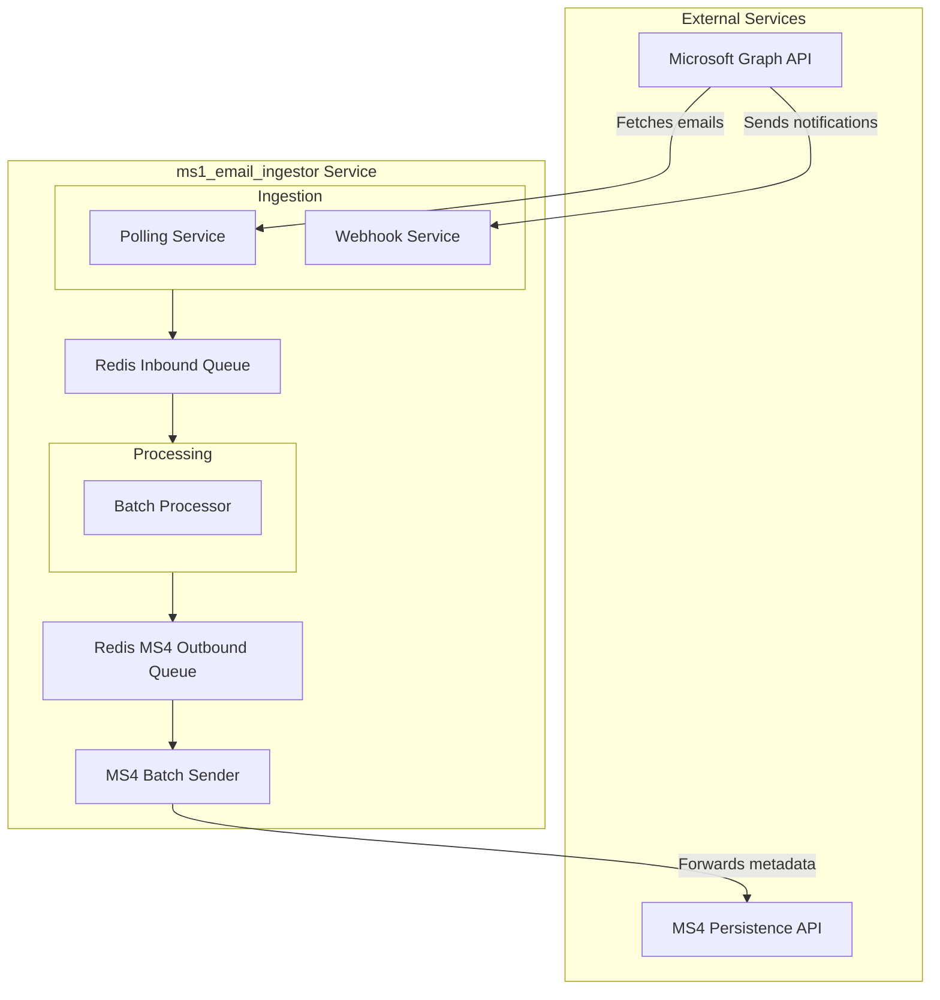

# 2. High Level Architecture

## 2.1. Technical Summary

The `ms1_email_ingestor` is a Python-based, queue-centric microservice designed for high-volume email ingestion and processing. It leverages Redis for resilient queuing, a `ThreadPool`-based batch processor for parallel execution, and FastAPI for its control and webhook APIs. The proposed architecture enhances this existing model by standardizing the HTTP client to `httpx`, introducing robust rate-limiting and retry mechanisms, and refactoring the core processing pipeline to support batch forwarding to downstream services via a dedicated outbound queue. This directly supports the PRD goals of performance, resilience, and modernization.

## 2.2. High Level Overview

The architecture is a **self-contained microservice** operating within a **monorepo** structure. The fundamental data flow is enhanced: email notifications are ingested via polling or webhooks and are immediately placed onto a Redis-backed inbound queue. A separate `batch_processor` service consumes from this inbound queue, processes the emails, and then places the prepared data onto a new **MS4 Outbound Queue**. A dedicated **MS4 Batch Sender** then consumes from this outbound queue and forwards aggregated metadata to the MS4 Persistence service. This evolution further hardens the system against external dependencies and optimizes for targeted, high-impact improvements like batching and resilience.

## 2.3. High Level Project Diagram

## 2.4. Architectural and Design Patterns

*   **Queue-Centric Workflow (Inbound):** We will retain the existing pattern of using a central Redis queue to decouple the ingestion and processing stages.
    *   *Rationale:* This is the cornerstone of the system's resilience and ability to buffer high-volume traffic, preventing data loss during processing spikes or downstream failures.
*   **Queue-Centric Workflow (Outbound to MS4):** A new Redis queue will be introduced to buffer processed data before it is sent to the MS4 Persistence service.
    *   *Rationale:* This further decouples our service from MS4, enhancing resilience against MS4 downtime or performance issues, and allows for optimized batching and retry logic specific to MS4.
*   **Batch Processing:** The `batch_processor` will prepare multiple processed items, and a new `MS4 Batch Sender` will collect these from the outbound queue before sending them to the MS4 service in a single outbound request.
    *   *Rationale:* This is the primary strategy to achieve the 10,000 invoice/session throughput goal by dramatically reducing network I/O overhead and optimizing for MS4's API.
*   **Circuit Breaker & Retry:** All outbound API calls (including from the new MS4 Batch Sender) will be wrapped with policies to handle transient faults.
    *   *Rationale:* As defined in Epic 2, this is critical for improving service resilience when interacting with external dependencies like the Microsoft Graph and MS4 APIs.
*   **Repository Pattern:** Data access will continue to be abstracted via dedicated manager modules (e.g., `redis_manager.py`).
    *   *Rationale:* This decouples business logic from the underlying data store implementation, simplifying testing and future maintenance.

---
