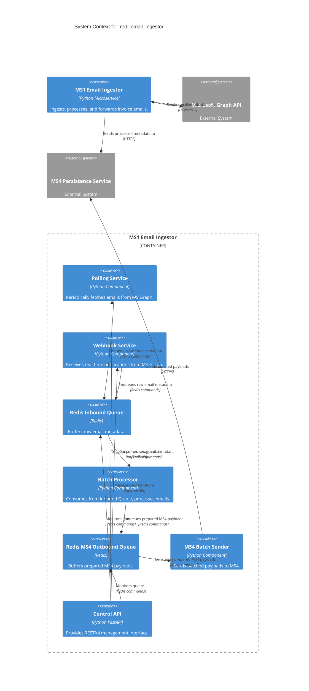

# 5. Components

## 5.1. Component List

## 5.1.1. Polling Service

**Responsibility:** Periodically fetches unread emails from the Microsoft Graph API, applies initial filtering, and enqueues the raw email metadata into the Redis Inbound Queue.

**Key Interfaces:**
- Outbound: Microsoft Graph API (HTTPS)
- Outbound: Redis Inbound Queue (Redis commands via `redis_manager`)

**Dependencies:** `httpx`, `MSAL`, `redis_manager`, `utils/config`.

**Technology Stack:** Python, `httpx`, `MSAL`.

## 5.1.2. Webhook Service

**Responsibility:** Receives real-time email notifications from Microsoft Graph via a webhook endpoint, validates them, and enqueues the raw email metadata into the Redis Inbound Queue. It also manages the lifecycle of Microsoft Graph webhook subscriptions.

**Key Interfaces:**
- Inbound: Microsoft Graph Webhook (HTTPS)
- Outbound: Redis Inbound Queue (Redis commands via `redis_manager`)
- Outbound: Microsoft Graph API (for subscription management, HTTPS)

**Dependencies:** FastAPI, `httpx`, `MSAL`, `redis_manager`, `utils/config`.

**Technology Stack:** Python, FastAPI, `httpx`, `MSAL`.

## 5.1.3. Redis Inbound Queue

**Responsibility:** Acts as a high-performance, resilient buffer for raw email metadata received from the Polling and Webhook Services. It decouples the ingestion process from the email processing logic.

**Key Interfaces:**
- Inbound: `redis_manager` (for enqueuing by Polling/Webhook Services)
- Outbound: `redis_manager` (for dequeuing by Batch Processor)

**Dependencies:** Redis server.

**Technology Stack:** Redis.

## 5.1.4. Batch Processor

**Responsibility:** Consumes raw email metadata from the Redis Inbound Queue, processes each email (e.g., extracts relevant data, applies business logic, transforms data into MS4-compatible format), and places the prepared MS4 payload onto the Redis MS4 Outbound Queue.

**Key Interfaces:**
- Inbound: Redis Inbound Queue (Redis commands via `redis_manager`)
- Outbound: Redis MS4 Outbound Queue (Redis commands via `redis_manager`)

**Dependencies:** `redis_manager`, `core/unified_email_processor` (for email-specific logic), `utils/config`.

**Technology Stack:** Python.

## 5.1.5. Redis MS4 Outbound Queue

**Responsibility:** Buffers prepared MS4 payloads, decoupling the `Batch Processor` from the `MS4 Batch Sender`. This provides additional resilience against MS4 unavailability and allows for optimized batching to MS4.

**Key Interfaces:**
- Inbound: `redis_manager` (for enqueuing by Batch Processor)
- Outbound: `redis_manager` (for dequeuing by MS4 Batch Sender)

**Dependencies:** Redis server.

**Technology Stack:** Redis.

## 5.1.6. MS4 Batch Sender

**Responsibility:** Consumes prepared MS4 payloads from the Redis MS4 Outbound Queue, aggregates them into optimal batches, and sends these batches to the MS4 Persistence API. It incorporates retry logic, rate limiting, and error handling specific to MS4 communication.

**Key Interfaces:**
- Inbound: Redis MS4 Outbound Queue (Redis commands via `redis_manager`)
- Outbound: MS4 Persistence API (HTTPS)

**Dependencies:** `httpx`, `redis_manager`, `utils/config`.

**Technology Stack:** Python, `httpx`.

## 5.1.7. Control API

**Responsibility:** Provides a RESTful interface for external systems or administrators to manage the `ms1_email_ingestor` service, including starting/stopping sessions, triggering manual polls, and retrieving service metrics.

**Key Interfaces:**
- Inbound: REST API (HTTPS)

**Dependencies:** FastAPI, `core/session_manager`, `core/queue_manager`, `utils/config`.

**Technology Stack:** Python, FastAPI.

## 5.2. Component Diagrams

---
