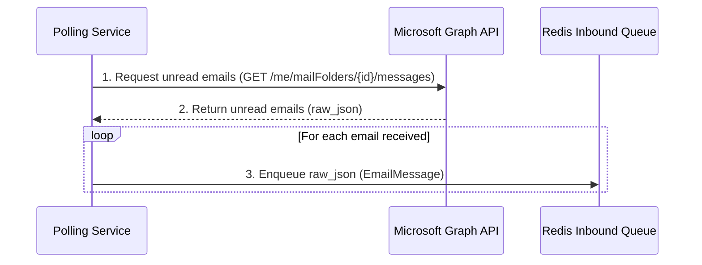
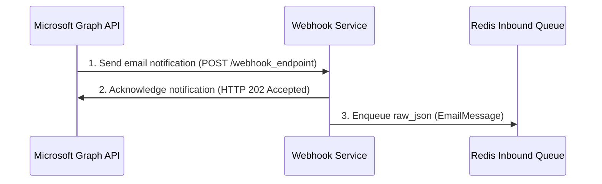
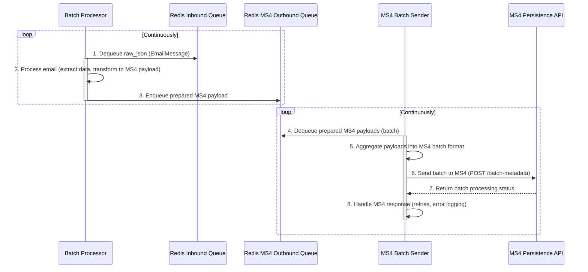

# 7. Core Workflows

## 7.1. Email Ingestion (Polling)

This workflow describes how the Polling Service actively fetches emails from Microsoft Graph and places them into the inbound queue.

## 7.2. Email Ingestion (Webhook)

This workflow illustrates how the Webhook Service passively receives notifications from Microsoft Graph and enqueues them.

## 7.3. Email Processing and MS4 Batch Forwarding

This workflow details the end-to-end processing of an email from the inbound queue, through the batch processor, and finally to the MS4 Persistence API via the new outbound queue and batch sender.

---
