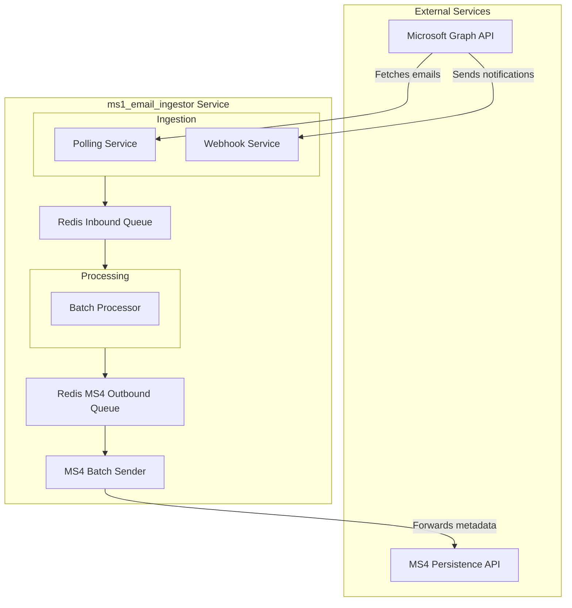

# ms1_email_ingestor Brownfield Architecture Document

## Introduction

This document captures the CURRENT STATE of the `ms1_email_ingestor` codebase, including its architecture, technical debt, and real-world patterns. It serves as a reference for AI agents and development teams working on enhancements, with a particular focus on improving performance to handle over 10,000 invoices per session.

### Document Scope

This is a comprehensive documentation of the entire system, with a special focus on areas relevant to performance enhancement, caching improvements, and system optimization, as guided by the Product Requirements Document (`docs/prd.md`).

### Change Log

| Date       | Version | Description                 | Author  |
|------------|---------|-----------------------------|---------|
| 2025-11-03 | 1.0     | Initial brownfield analysis | Winston |

## Quick Reference - Key Files and Entry Points

### Critical Files for Understanding the System

- **Main Entry**: `main_orchestrator.py` (Coordinates all services)
- **Configuration**: `utils/config.py` (Centralized configuration)
- **Core Business Logic**:
    - `core/unified_email_processor.py` (Single email processing logic)
    - `core/batch_processor.py` (Parallel processing engine)
- **API Definitions**:
    - `api/ms1_apiHanlder.py` (Control API endpoints)
    - `api/webhook_app.py` (FastAPI app for MS Graph webhooks)
- **Queue Management**: `core/queue_manager.py` (Redis-backed email queue)
- **Session Management**: `core/session_manager.py` (Manages ingestion sessions)
- **Authentication**: `core/token_manager.py` (Handles MS Graph API tokens)
- **Redis Interaction**: `cache/redis_manager.py` (Centralized Redis interaction logic)

## High Level Architecture

The `ms1_email_ingestor` is a Python-based, queue-centric microservice designed for high-volume email ingestion and processing. It leverages Redis for resilient queuing, a `ThreadPool`-based batch processor for parallel execution, and FastAPI for its control and webhook APIs. The architecture enhances this existing model by standardizing the HTTP client to `httpx`, introducing robust rate-limiting and retry mechanisms, and refactoring the core processing pipeline to support batch forwarding to downstream services via a dedicated outbound queue. This directly supports the PRD goals of performance, resilience, and modernization.

The architecture is a **self-contained microservice** operating within a **monorepo** structure. The fundamental data flow is enhanced: email notifications are ingested via polling or webhooks and are immediately placed onto a Redis-backed inbound queue. A separate `batch_processor` service consumes from this inbound queue, processes the emails, and then places the prepared data onto a new **MS4 Outbound Queue**. A dedicated **MS4 Batch Sender** then consumes from this outbound queue and forwards aggregated metadata to the MS4 Persistence service. This evolution further hardens the system against external dependencies and optimizes for targeted, high-impact improvements like batching and resilience.

### High Level Project Diagram



### Actual Tech Stack

| Category      | Technology   | Version/Details                                 | Notes                                                                 |
|---------------|--------------|-------------------------------------------------|-----------------------------------------------------------------------|
| Language      | Python       | 3.x                                             |                                                                       |
| Web Framework | FastAPI      | For the webhook endpoint (`api/webhook_app.py`) and Control API (`api/ms1_apiHanlder.py`) | Runs as a separate process.                                           |
| Async Server  | Uvicorn      | Standard ASGI server                            |                                                                       |
| Data Store    | Redis        | For queuing and session management              | Critical component for state management and buffering.                |
| HTTP Client   | httpx        | All outbound HTTP requests                      | Standardized client (as per PRD NFR2), async support, connection pooling (as per PRD NFR3). |
| Authentication| MSAL         | `msal` library for Microsoft identity           | Acquires tokens for Graph API access.                                 |
| Other         | pyngrok      | To expose the local webhook endpoint            | A key component for the webhook service.                              |

### Repository Structure Reality Check

- **Type**: Monorepo (single repository for the microservice).
- **Package Manager**: `pip` with `requirements.txt`.
- **Notable**: The project is well-structured, with a clear separation of concerns between `api`, `core`, `cache`, and `utils`. The `cache` directory contains `redis_manager.py` and `session_manager.py` which abstract Redis interactions.

## Source Tree and Module Organization

### Project Structure (Actual)

```text
project-root/
├── api/                  # FastAPI application for webhooks and control API
│   ├── ms1_apiHanlder.py # Control API endpoints (e.g., /session/start, /metrics)
│   └── webhook_app.py    # The webhook endpoint logic
├── cache/                # Redis interaction and session management
│   ├── redis_manager.py  # Centralized Redis interaction logic (queues, session, rate limiting)
│   └── session_manager.py# Manages ingestion session state (uses redis_manager)
├── core/                 # Core business logic
│   ├── batch_processor.py  # Parallel email processing engine
│   ├── get_access_token.py # Handles initial OAuth2 authorization flow
│   ├── ms4_batch_sender.py # Consumes from MS4 Outbound Queue, sends batched payloads to MS4
│   ├── polling_service.py  # Scheduled email fetching
│   ├── queue_manager.py    # Redis-backed queue for emails
│   ├── session_manager.py  # Manages the ingestion session state (deprecated, use cache/session_manager.py)
│   ├── token_manager.py    # MSAL token handling
│   ├── unified_email_processor.py # Logic for processing a single email
│   └── webhook_service.py  # Manages MS Graph webhook subscriptions
├── docs/                 # Project documentation
│   ├── architecture/     # Sharded architecture documents
│   ├── prd/              # Sharded PRD documents
│   ├── qa/               # QA gates and checklists
│   └── stories/          # User stories
├── utils/                # Utility functions and configuration
│   ├── api_retry.py      # Decorator for API retry logic
│   ├── config.py         # Centralized application configuration
│   └── token_manager.py  # (Deprecated, use core/token_manager.py)
├── main_orchestrator.py  # Main application entry point
├── requirements.txt      # Project dependencies
├── tests/                # Unit and integration tests
│   ├── integration/      # Integration tests
│   └── unit/             # Unit tests
└── .env                  # Environment variables
```

### Key Modules and Their Purpose

- **`main_orchestrator.py`**: The heart of the application. It initializes and coordinates the `polling_service`, `webhook_service`, `batch_processor`, and `ms4_batch_sender`.
- **`cache/redis_manager.py`**: Implements a high-performance, Redis-backed queue that supports batching and priority. This is central to the system's ability to handle high volume. It also manages session state, rate limiting, and metrics.
- **`core/batch_processor.py`**: The processing engine. It uses a `ThreadPoolExecutor` to process emails in parallel, accumulates processed email payloads, and enqueues them to the Redis MS4 Outbound Queue.
- **`core/unified_email_processor.py`**: Contains the business logic for processing a single email. It now returns a structured JSON payload instead of directly calling the MS4 service.
- **`core/polling_service.py`**: Periodically fetches unread emails from the Microsoft Graph API, applies initial filtering, and enqueues the raw email metadata into the Redis Inbound Queue. It includes proactive rate limiting and error backoff.
- **`core/webhook_service.py`**: Receives real-time email notifications from Microsoft Graph via a webhook endpoint, validates them, and enqueues the raw email metadata into the Redis Inbound Queue. It also manages the lifecycle of Microsoft Graph webhook subscriptions, including proactive rate limiting and error backoff.
- **`core/ms4_batch_sender.py`**: A new component that consumes prepared MS4 payloads from the Redis MS4 Outbound Queue, aggregates them into optimal batches, and sends these batches to the MS4 Persistence API. It incorporates retry logic, rate limiting, and error handling specific to MS4 communication.
- **`api/ms1_apiHanlder.py`**: Provides a RESTful interface for external systems or administrators to manage the `ms1_email_ingestor` service, including starting/stopping sessions, triggering manual polls, and retrieving service metrics. It now includes `/health` and `/metrics` endpoints.
- **`utils/api_retry.py`**: A decorator for implementing retry mechanisms with exponential backoff for external API calls.

## Data Models and APIs

### Data Models

The primary data model is the email message object from the Microsoft Graph API. This is passed through the system as a dictionary.

### Redis Data Structures

The `cache/redis_manager.py` provides a sophisticated abstraction over Redis, using specific data structures for efficiency and concurrency.

| Key Prefix             | Redis Type    | Purpose                                                              |
|------------------------|---------------|----------------------------------------------------------------------|
| `email:processed`      | Set           | Stores IDs of processed emails for O(1) duplicate checks.            |
| `queue:emails`         | Sorted Set    | A priority queue for pending emails, with the score being a timestamp. |
| `queue:processing`     | Sorted Set    | Stores emails currently being processed, with a timeout timestamp.   |
| `queue:failed`         | Sorted Set    | A Dead Letter Queue (DLQ) for emails that failed processing.         |
| `session:current`      | Hash          | Stores the state and metadata of the currently active session.       |
| `sessions:history`     | List          | A capped list that stores historical session data for auditing.      |
| `webhook:subscription` | Hash          | Caches the current MS Graph webhook subscription details.            |
| `auth:refresh_token`   | String        | Stores the OAuth refresh token for the MSAL library.                 |
| `lock:*`               | String        | Used for distributed locks to prevent race conditions.               |
| `metrics:*`            | Hash          | Stores daily metrics, like `emails_processed`.                       |
| `ratelimit:*`          | String        | A counter used for implementing rate limiting logic.                 |

### API Specifications

#### Control API (`api/ms1_apiHanlder.py`)

A FastAPI application provides a RESTful control plane for the service, running on port 8000.

-   **`POST /session/start`**: Starts a new ingestion session.
    -   **Body**: `{"polling_mode": "scheduled" | "manual", "polling_interval": 300, "enable_webhook": true}`
-   **`POST /session/stop`**: Stops the current session.
    -   **Body**: `{"reason": "user_requested"}`
-   **`GET /session/status`**: Retrieves the status of the current session, including all services and queue stats.
-   **`POST /polling/trigger`**: Manually triggers a one-time poll for unread emails.
-   **`GET /metrics`**: Provides high-level metrics about the current session, sourced from `redis_manager`.
-   **`GET /health`**: Returns a `200 OK` status if the service is running and can connect to Redis, otherwise `503 Service Unavailable`.

#### External APIs

-   **Microsoft Graph API**: Heavily used for fetching emails, managing webhooks, and marking emails as read. All calls are now wrapped with proactive rate limiting and an exponential backoff retry strategy.
-   **MS4 Persistence Service**: The `unified_email_processor` no longer makes direct calls. Instead, processed payloads are sent in batches by the `ms4_batch_sender` to the `/batch-metadata` endpoint.

## Technical Debt and Known Issues

### Critical Technical Debt

-   **Inconsistent Session/Token Managers**: There are `session_manager.py` and `token_manager.py` in both `core/` and `cache/` (for session) or `utils/` (for token). These should be consolidated to avoid confusion and ensure a single source of truth. The `cache/redis_manager.py` already handles much of the session state.

### Workarounds and Gotchas

-   **`pyngrok` Dependency**: The webhook service is critically dependent on `ngrok` for local development. If `ngrok` is down or blocked, the real-time ingestion will fail, and the system will have to rely on polling. This dependency is primarily for local development and would be replaced by a public endpoint in a production deployment.
-   **Redis State**: The application's state is entirely dependent on Redis. The `cache/redis_manager.py` and `cache/session_manager.py` provide the interface for managing this state.

## Integration Points and External Dependencies

### External Services

| Service           | Purpose                               | Integration Type | Key Files                               |
|-------------------|---------------------------------------|------------------|-----------------------------------------|
| Microsoft Graph   | Email fetching and notifications      | REST API         | `polling_service.py`, `webhook_service.py` |
| MS4 Persistence   | Data persistence                      | REST API         | `ms4_batch_sender.py`                   |
| ngrok             | Public URL for webhook (local dev)    | SDK              | `webhook_service.py`                    |

## Development and Deployment

### Local Development Setup

1.  Install dependencies: `pip install -r requirements.txt`
2.  Set up a `.env` file with the required `CLIENT_ID` and `CLIENT_SECRET`.
3.  Ensure Redis is running and accessible.
4.  Run the main orchestrator: `python main_orchestrator.py`

### Developer Utilities

-   **Session Management CLI**: The `cache/session_manager.py` script provides a command-line interface to view, clear, and reset session data in Redis. This is an essential tool for development and debugging.
    ```bash
    # View current session info
    python cache/session_manager.py info

    # Clear the current session
    python cache/session_manager.py clear
    ```

### Build and Deployment Process

There is no formal build or deployment process documented. The application is run directly from the Python source code. Future deployment to AWS is envisioned to be containerized.

## Testing Reality

### Current Test Coverage

The `tests/` directory contains unit, integration, and performance tests.
- Unit tests are in `tests/unit/`.
- Integration tests are in `tests/integration/`.
- Performance tests are in `tests/`.

### Running Tests

The recommended way to run tests is using `pytest`.
```bash
pip install pytest
python -m pytest
```

## Enhancement Focus: Performance for 10,000+ Invoices

### Potential Bottlenecks

1.  **API Rate Limiting**: Proactive rate limiting and exponential backoff have been implemented for Microsoft Graph API calls.
2.  **MS4 Communication**: Direct, single-email forwarding to MS4 has been replaced with batch forwarding via a dedicated `MS4 Batch Sender` and an outbound queue, significantly reducing network I/O.
3.  **Redis Contention**: The use of Lua scripts for atomic operations in Redis helps mitigate contention.

### Caching and Performance Improvement Suggestions (Implemented/Addressed)

1.  **Activate and Use Built-in Rate Limiting**: Implemented in `core/polling_service.py` and `core/webhook_service.py` using `redis_manager.check_rate_limit`.
2.  **Implement Graph API Rate Limit Handling**: Implemented an exponential backoff strategy with `Retry-After` header processing using the `utils/api_retry.py` decorator.
3.  **Batch Forwarding to MS4**: Implemented via `core/ms4_batch_sender.py` and the Redis MS4 Outbound Queue.
4.  **Connection Pooling**: `httpx` is used for all external HTTP communication, which inherently supports connection pooling.

## Appendix - Useful Commands and Scripts

### Starting the Service

```bash
# Run the main orchestrator with default settings (scheduled polling and webhooks)
python main_orchestrator.py

# Run in polling-only mode
python main_orchestrator.py --no-webhook

# Trigger a single poll and exit
python main_orchestrator.py --poll-once
```
### Interacting with the Control API
```bash
# Get session status
curl http://localhost:8000/session/status

# Start a new session
curl -X POST http://localhost:8000/session/start -H "Content-Type: application/json" -d '{}'

# Stop the current session
curl -X POST http://localhost:8000/session/stop -H "Content-Type: application/json" -d '{"reason": "manual_stop"}'

# Get health status
curl http://localhost:8000/health

# Get metrics
curl http://localhost:8000/metrics
```